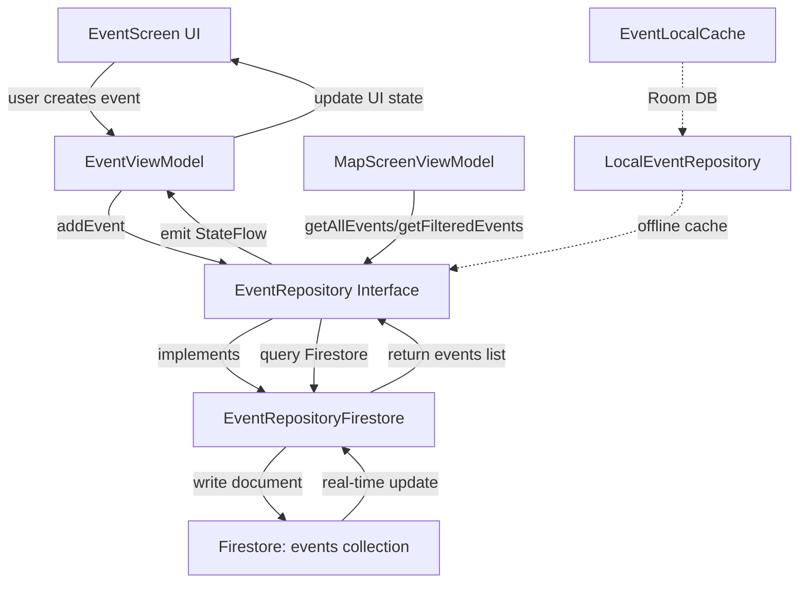
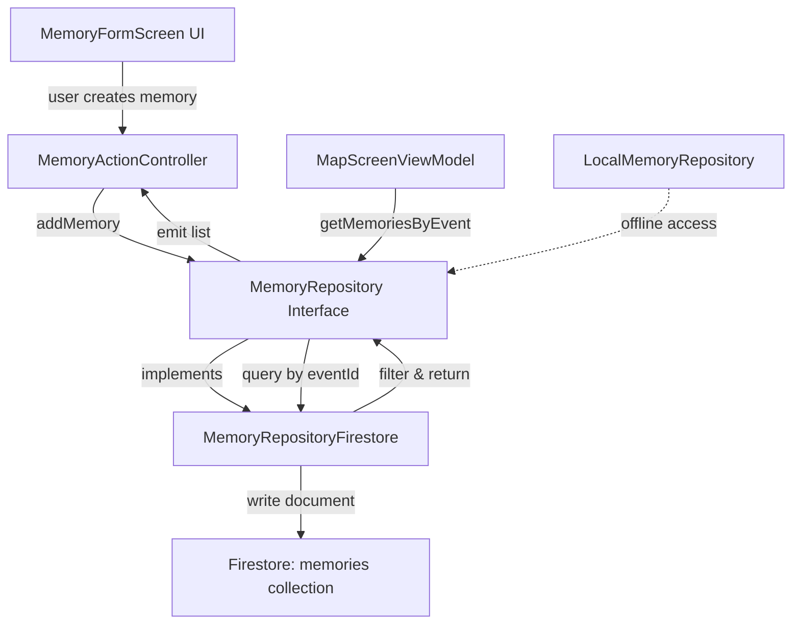
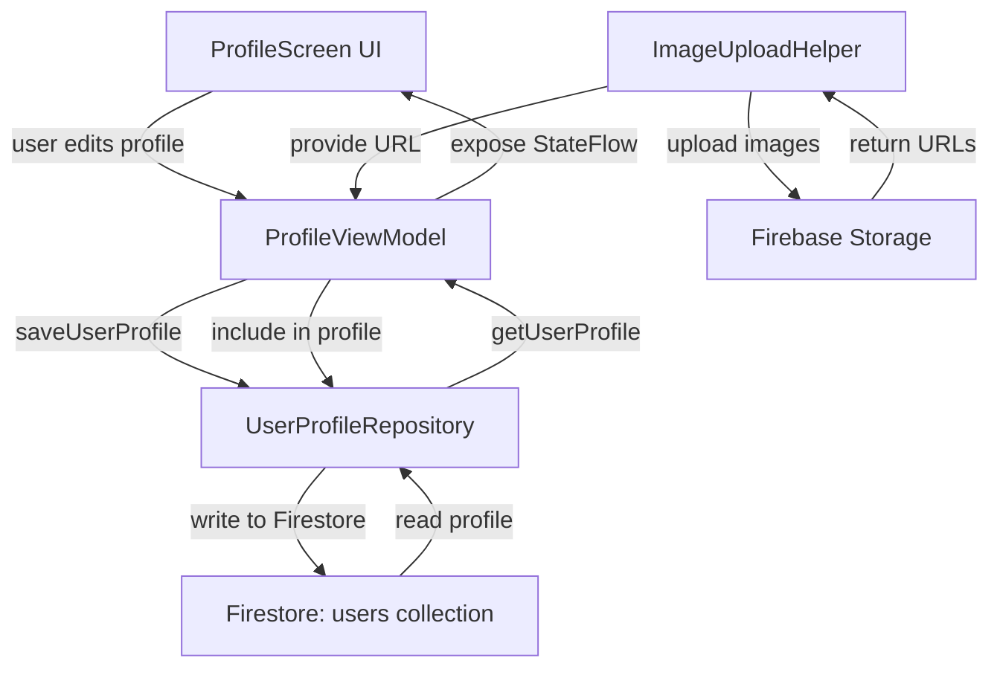
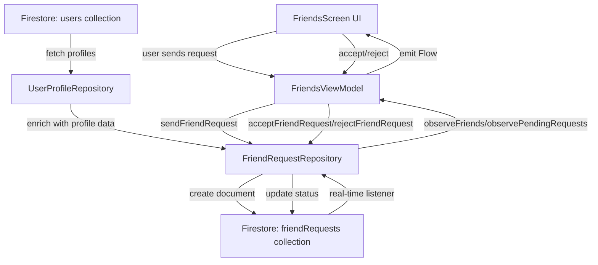
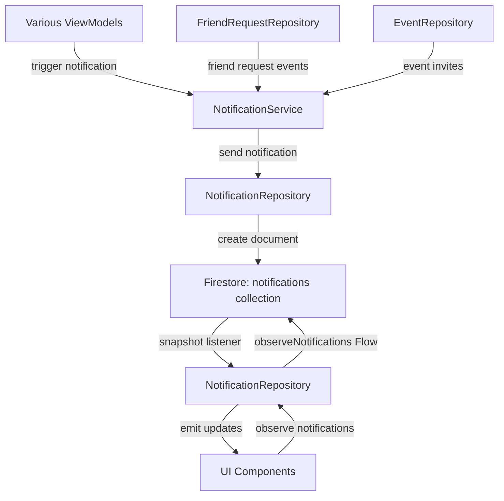
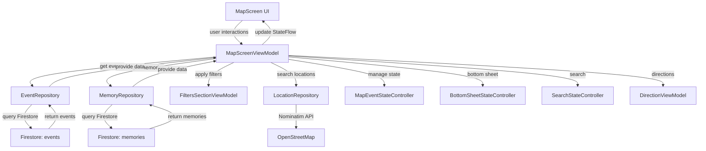

# Map'In Architecture Documentation

This document provides a comprehensive overview of the Map'In application architecture, detailing the flows between UI, ViewModel, Repository, and Firestore layers.

**📊 Start with the [Complete Application Architecture Diagram](#complete-application-architecture-diagram) to see all flows in one unified view.**

## Table of Contents
1. [Architecture Overview](#architecture-overview)
   - [Complete Application Architecture Diagram](#complete-application-architecture-diagram) - **Unified diagram showing all flows**
2. [Layer Responsibilities](#layer-responsibilities)
3. [Component Flows](#component-flows)
4. [Data Flow Patterns](#data-flow-patterns)

---

## Architecture Overview

Map'In follows the **MVVM (Model-View-ViewModel)** architecture pattern with a clean separation of concerns.

### Complete Application Architecture Diagram

This comprehensive diagram shows all major flows in the Map'In application, including Events, Memories, User Profiles, Friends, Notifications, and the Map Screen coordination:

```mermaid
graph TB
    subgraph "UI Layer - Jetpack Compose"
        UI1[EventScreen]
        UI2[MemoryFormScreen]
        UI3[ProfileScreen]
        UI4[FriendsScreen]
        UI5[MapScreen]
        UI6[SettingsScreen]
    end
    
    subgraph "ViewModel Layer - Business Logic & State Management"
        VM1[EventViewModel]
        VM2[MemoryActionController]
        VM3[ProfileViewModel]
        VM4[FriendsViewModel]
        VM5[MapScreenViewModel]
        VM6[FiltersSectionViewModel]
        VM7[DirectionViewModel]
        VM8[SignInViewModel]
        VM9[SettingsViewModel]
    end
    
    subgraph "Repository Layer - Data Access Abstraction"
        R1[EventRepository]
        R2[MemoryRepository]
        R3[UserProfileRepository]
        R4[FriendRequestRepository]
        R5[NotificationRepository]
        R6[LocationRepository]
        R7[PreferencesRepository]
        
        R1_IMPL[EventRepositoryFirestore]
        R2_IMPL[MemoryRepositoryFirestore]
        R1_LOCAL[LocalEventRepository]
        R2_LOCAL[LocalMemoryRepository]
    end
    
    subgraph "Helper Services"
        H1[ImageUploadHelper]
        H2[NotificationService]
    end
    
    subgraph "Firestore Database - Cloud Storage"
        FS1[(events collection)]
        FS2[(memories collection)]
        FS3[(users collection)]
        FS4[(friendRequests collection)]
        FS5[(notifications collection)]
    end
    
    subgraph "Local Storage"
        LOCAL1[(Room DB - EventLocalCache)]
        LOCAL2[(DataStore - Preferences)]
    end
    
    subgraph "External Services"
        EXT1[Firebase Storage]
        EXT2[Nominatim API - OpenStreetMap]
    end
    
    %% Event Flow
    UI1 -->|user actions| VM1
    VM1 -->|CRUD operations| R1
    R1 -.->|interface| R1_IMPL
    R1_IMPL -->|read/write| FS1
    FS1 -.->|real-time updates| R1_IMPL
    R1 -.->|offline cache| R1_LOCAL
    R1_LOCAL -.->|Room DB| LOCAL1
    
    %% Memory Flow
    UI2 -->|create memory| VM2
    VM2 -->|addMemory| R2
    R2 -.->|interface| R2_IMPL
    R2_IMPL -->|write| FS2
    FS2 -.->|query by event| R2_IMPL
    R2 -.->|offline access| R2_LOCAL
    
    %% Profile Flow
    UI3 -->|edit profile| VM3
    VM3 -->|saveUserProfile| R3
    R3 -->|write| FS3
    FS3 -.->|read profile| R3
    VM3 -->|upload images| H1
    H1 -->|store media| EXT1
    EXT1 -.->|return URLs| H1
    
    %% Friends Flow
    UI4 -->|send request| VM4
    VM4 -->|sendFriendRequest| R4
    R4 -->|create/update| FS4
    FS4 -.->|real-time listener| R4
    R4 -->|enrich with profiles| R3
    R3 -->|fetch user data| FS3
    
    %% Notification Flow
    R4 -.->|friend events| H2
    R1_IMPL -.->|event updates| H2
    R2_IMPL -.->|memory tags| H2
    H2 -->|send notification| R5
    R5 -->|create| FS5
    FS5 -.->|real-time updates| R5
    
    %% Map Screen Coordination
    UI5 -->|coordinates all| VM5
    VM5 -->|get events| R1
    VM5 -->|get memories| R2
    VM5 -->|apply filters| VM6
    VM5 -->|search locations| R6
    VM5 -->|navigation| VM7
    R6 -->|geocoding| EXT2
    
    %% Settings Flow
    UI6 -->|user preferences| VM9
    VM9 -->|save settings| R7
    R7 -->|persist| LOCAL2
    
    %% Auth Flow
    UI1 -.->|authentication| VM8
    UI3 -.->|authentication| VM8
    UI4 -.->|authentication| VM8
    UI5 -.->|authentication| VM8
    
    %% Cross-cutting flows
    VM5 -.->|uses| VM2
    VM1 -.->|refresh map| VM5
    
    classDef uiClass fill:#e1f5ff,stroke:#01579b,stroke-width:2px
    classDef vmClass fill:#fff3e0,stroke:#e65100,stroke-width:2px
    classDef repoClass fill:#f3e5f5,stroke:#4a148c,stroke-width:2px
    classDef fsClass fill:#e8f5e9,stroke:#1b5e20,stroke-width:2px
    classDef localClass fill:#fff9c4,stroke:#f57f17,stroke-width:2px
    classDef helperClass fill:#fce4ec,stroke:#880e4f,stroke-width:2px
    classDef extClass fill:#e0f2f1,stroke:#004d40,stroke-width:2px
    
    class UI1,UI2,UI3,UI4,UI5,UI6 uiClass
    class VM1,VM2,VM3,VM4,VM5,VM6,VM7,VM8,VM9 vmClass
    class R1,R2,R3,R4,R5,R6,R7,R1_IMPL,R2_IMPL,R1_LOCAL,R2_LOCAL repoClass
    class FS1,FS2,FS3,FS4,FS5 fsClass
    class LOCAL1,LOCAL2 localClass
    class H1,H2 helperClass
    class EXT1,EXT2 extClass
```



**Legend:**
- **Solid arrows (→)**: Direct method calls and data flow
- **Dashed arrows (-.->)**: Interface implementations, real-time listeners, or optional flows
- **Color coding**:
  - 🔵 Blue: UI Layer (Jetpack Compose screens)
  - 🟠 Orange: ViewModel Layer (business logic)
  - 🟣 Purple: Repository Layer (data access)
  - 🟢 Green: Firestore Collections (cloud storage)
  - 🟡 Yellow: Local Storage (Room DB, DataStore)
  - 🔴 Pink: Helper Services
  - 🟦 Teal: External Services (Firebase Storage, APIs)

### Layer Overview

```
┌─────────────────────────────────────────────────────────────────┐
│                          UI Layer                                │
│  (Jetpack Compose Screens - View)                               │
└────────────────────────────┬────────────────────────────────────┘
                             │
                             │ observes StateFlow/LiveData
                             │ invokes methods
                             ▼
┌─────────────────────────────────────────────────────────────────┐
│                       ViewModel Layer                            │
│  (Business Logic, State Management)                             │
└────────────────────────────┬────────────────────────────────────┘
                             │
                             │ calls suspend functions
                             │ implements interface
                             ▼
┌─────────────────────────────────────────────────────────────────┐
│                      Repository Layer                            │
│  (Data Access Abstraction, Interface Contracts)                 │
└────────────────────────────┬────────────────────────────────────┘
                             │
                             │ read/write operations
                             │ real-time listeners
                             ▼
┌─────────────────────────────────────────────────────────────────┐
│                    Firestore Database                            │
│  (Cloud Storage, Real-time Sync)                                │
└─────────────────────────────────────────────────────────────────┘
```

---

## Layer Responsibilities

### 1. UI Layer (Jetpack Compose)
- **Responsibility**: Display data and capture user interactions
- **Components**: 
  - Composable functions for screens
  - UI state rendering
  - User input handling
- **Location**: `app/src/main/java/com/swent/mapin/ui/`

### 2. ViewModel Layer
- **Responsibility**: Manage UI state, handle business logic, coordinate repository calls
- **Characteristics**:
  - Lifecycle-aware components
  - Expose StateFlow/LiveData to UI
  - Launch coroutines in viewModelScope
  - No direct Firestore dependencies
- **Location**: Various locations under `ui/` packages

### 3. Repository Layer
- **Responsibility**: Abstract data sources, provide clean API for data access
- **Characteristics**:
  - Interface-based design
  - Suspend functions for async operations
  - Multiple implementations (Firestore, Local)
  - Error handling and data transformation
- **Location**: `app/src/main/java/com/swent/mapin/model/`

### 4. Firestore Database
- **Responsibility**: Persistent cloud storage, real-time synchronization
- **Collections**:
  - `events` - Event data
  - `memories` - Memory/media data
  - `users` - User profiles
  - `friendRequests` - Friend relationships
  - `notifications` - User notifications

---

## Component Flows

### Event Management Flow



**Flow Steps:**
1. **UI → ViewModel**: User creates/edits/deletes event via UI
2. **ViewModel → Repository**: EventViewModel calls repository methods (addEvent, editEvent, deleteEvent)
3. **Repository → Firestore**: EventRepositoryFirestore writes to Firestore `events` collection
4. **Firestore → Repository → ViewModel**: Data syncs back via real-time listeners or queries
5. **ViewModel → UI**: StateFlow emits new state, UI recomposes

**Key Files:**
- UI: `ui/event/EventScreen.kt`, `ui/map/MapScreen.kt`
- ViewModel: `ui/event/EventViewModel.kt`, `ui/map/MapScreenViewModel.kt`
- Repository: `model/event/EventRepository.kt`, `model/event/EventRepositoryFirestore.kt`
- Local Cache: `model/event/LocalEventRepository.kt`, `model/event/EventLocalCache.kt`

---

### Memory Management Flow



**Flow Steps:**
1. **UI → Controller**: User adds memory with media via MemoryFormScreen
2. **Controller → Repository**: MemoryActionController calls addMemory
3. **Repository → Firestore**: MemoryRepositoryFirestore writes to `memories` collection
4. **Queries**: Support filtering by event, owner, time range, tagged users
5. **Privacy**: Public/private visibility controlled at repository level

**Key Files:**
- UI: `ui/memory/MemoryFormScreen.kt`
- Controller: `ui/memory/MemoryActionController.kt`
- Repository: `model/memory/MemoryRepository.kt`, `model/memory/MemoryRepositoryFirestore.kt`
- Local: `model/memory/LocalMemoryRepository.kt`

---

### User Profile Management Flow



**Flow Steps:**
1. **UI → ViewModel**: User edits profile (name, bio, location, hobbies, avatar, banner)
2. **Image Upload**: ProfileViewModel uses ImageUploadHelper for Firebase Storage
3. **ViewModel → Repository**: saveUserProfile called with updated UserProfile
4. **Repository → Firestore**: UserProfileRepository writes to `users/{userId}` document
5. **Load Flow**: getUserProfile fetches from Firestore, creates default if not exists
6. **State Management**: StateFlow exposes profile to UI for reactive updates

**Key Files:**
- UI: `ui/profile/ProfileScreen.kt`
- ViewModel: `ui/profile/ProfileViewModel.kt`
- Repository: `model/UserProfileRepository.kt`
- Helper: `model/ImageUploadHelper.kt`

---

### Friend Request Flow



**Flow Steps:**
1. **Search**: User searches for friends via searchUsersWithStatus
2. **Send Request**: FriendsViewModel → FriendRequestRepository → Firestore
3. **Real-time Updates**: Repository uses Flow with snapshot listeners
4. **Status Tracking**: PENDING, ACCEPTED, REJECTED states
5. **Bidirectional**: Friendship stored as ACCEPTED status, visible to both users
6. **Profile Enrichment**: Requests enriched with UserProfile data for display

**Key Files:**
- UI: `ui/friends/FriendsScreen.kt`
- ViewModel: `ui/friends/FriendsViewModel.kt`
- Repository: `model/FriendRequestRepository.kt`, `model/UserProfileRepository.kt`
- Model: `model/FriendRequest.kt`

---

### Notification Flow



**Flow Steps:**
1. **Creation**: System/user actions trigger notification creation
2. **Service → Repository**: NotificationService calls NotificationRepository.send
3. **Repository → Firestore**: Write to `notifications/{notificationId}`
4. **Real-time Updates**: observeNotifications returns Flow with snapshot listener
5. **Read Status**: markAsRead updates readStatus field
6. **Priority**: HIGH/MEDIUM/LOW for sorting and display
7. **Types**: FRIEND_REQUEST, EVENT_INVITE, EVENT_UPDATE, MEMORY_TAGGED, etc.

**Key Files:**
- Service: `model/NotificationService.kt`
- Repository: `model/NotificationRepository.kt`
- Model: `model/Notification.kt`

---

### Map Screen Flow (Unified)



**MapScreenViewModel Responsibilities:**
- Coordinate multiple state controllers
- Fetch and filter events/memories
- Handle location and search
- Manage map camera position
- Control bottom sheet states
- Integrate with DirectionViewModel for navigation

**Key Files:**
- UI: `ui/map/MapScreen.kt`
- ViewModel: `ui/map/MapScreenViewModel.kt`
- Controllers: 
  - `ui/map/eventstate/MapEventStateController.kt`
  - `ui/map/bottomsheet/BottomSheetStateController.kt`
  - `ui/map/search/SearchStateController.kt`
- Filters: `ui/filters/FiltersSectionViewModel.kt`
- Directions: `ui/map/directions/DirectionViewModel.kt`

---

## Data Flow Patterns

### 1. Read Flow (Query Pattern)

```
UI requests data
    ↓
ViewModel launches coroutine
    ↓
Repository suspend function called
    ↓
Firestore query executed
    ↓
Documents transformed to domain models
    ↓
Repository returns List<Model>
    ↓
ViewModel updates StateFlow
    ↓
UI recomposes with new data
```

**Example:**
```kotlin
// ViewModel
viewModelScope.launch {
    val events = eventRepository.getAllEvents()
    _events.value = events
}

// Repository
override suspend fun getAllEvents(): List<Event> {
    val snapshot = db.collection("events").get().await()
    return snapshot.documents.mapNotNull { documentToEvent(it) }
}
```

---

### 2. Write Flow (Command Pattern)

```
UI triggers action
    ↓
ViewModel validates input
    ↓
ViewModel calls repository method
    ↓
Repository creates/updates Firestore document
    ↓
Firestore confirms write
    ↓
ViewModel triggers refresh or updates state
    ↓
UI reflects changes
```

**Example:**
```kotlin
// ViewModel
fun addEvent(event: Event) {
    viewModelScope.launch {
        try {
            eventRepository.addEvent(event)
            stateController.refreshEventsList()
        } catch (e: Exception) {
            _error.value = e.message
        }
    }
}

// Repository
override suspend fun addEvent(event: Event) {
    db.collection("events")
        .document(event.eventID)
        .set(event)
        .await()
}
```

---

### 3. Real-time Flow (Observer Pattern)

```
UI subscribes to Flow
    ↓
ViewModel collects from repository Flow
    ↓
Repository creates callbackFlow with snapshot listener
    ↓
Firestore triggers listener on changes
    ↓
Repository emits new data to Flow
    ↓
ViewModel updates StateFlow
    ↓
UI automatically recomposes
```

**Example:**
```kotlin
// Repository
fun observeFriends(userId: String): Flow<List<FriendWithProfile>> = callbackFlow {
    val listener = firestore.collection("friendRequests")
        .whereEqualTo("userId", userId)
        .addSnapshotListener { snapshot, error ->
            if (error != null) {
                close(error)
                return@addSnapshotListener
            }
            val friends = snapshot?.documents?.mapNotNull { doc ->
                // transform to domain model
            } ?: emptyList()
            trySend(friends)
        }
    awaitClose { listener.remove() }
}

// ViewModel
init {
    viewModelScope.launch {
        repo.observeFriends(currentUserId).collect { friends ->
            _friends.value = friends
        }
    }
}
```

---

### 4. Local Caching Pattern

```
UI requests data
    ↓
ViewModel calls repository
    ↓
Repository checks local cache first
    ↓
If cache hit: return immediately
If cache miss: query Firestore
    ↓
Repository updates local cache
    ↓
Return data to ViewModel
```

**Implementation:**
- **Events**: `LocalEventRepository` with Room database via `EventLocalCache`
- **Memories**: `LocalMemoryRepository` for offline access
- **Saved Events**: Cached in subcollection `users/{userId}/savedEvents`

**Key Files:**
- `model/event/EventLocalCache.kt`
- `model/event/LocalEventRepository.kt`
- `model/event/SavedEventDao.kt`
- `model/memory/LocalMemoryRepository.kt`

---

## Repository Interface Design

All repositories follow a consistent pattern:

```kotlin
interface Repository {
    // ID Generation
    fun getNewUid(): String
    
    // Read Operations (suspend)
    suspend fun getAll(): List<Model>
    suspend fun getById(id: String): Model
    suspend fun getFiltered(filters: Filters): List<Model>
    
    // Write Operations (suspend)
    suspend fun add(model: Model)
    suspend fun edit(id: String, model: Model)
    suspend fun delete(id: String)
    
    // Optional: Real-time Observations
    fun observe(params: Params): Flow<List<Model>>
}
```

**Benefits:**
- Testability: Easy to mock for unit tests
- Flexibility: Can swap implementations (Firestore, Local, Mock)
- Separation: ViewModels don't depend on Firebase directly
- Consistency: Uniform API across all data sources

---

## Complete Component Map

### ViewModels
| ViewModel | Repository Dependencies | Purpose |
|-----------|------------------------|---------|
| EventViewModel | EventRepository | Event CRUD operations |
| MapScreenViewModel | EventRepository, MemoryRepository, UserProfileRepository | Map display coordination |
| ProfileViewModel | UserProfileRepository, ImageUploadHelper | Profile management |
| FriendsViewModel | FriendRequestRepository | Friend management |
| FiltersSectionViewModel | - | Filter state management |
| DirectionViewModel | - | Navigation and routing |
| SignInViewModel | - | Authentication |
| SettingsViewModel | PreferencesRepository | App settings |
| LocationViewModel | LocationRepository | Location services |

### Repositories
| Repository | Firestore Collection | Interface | Implementation |
|------------|---------------------|-----------|----------------|
| EventRepository | `events` | ✓ | EventRepositoryFirestore, LocalEventRepository |
| MemoryRepository | `memories` | ✓ | MemoryRepositoryFirestore, LocalMemoryRepository |
| UserProfileRepository | `users` | ✗ | Direct Firestore access |
| FriendRequestRepository | `friendRequests` | ✗ | Direct Firestore access |
| NotificationRepository | `notifications` | ✗ | Direct Firestore access |
| LocationRepository | N/A (API) | ✓ | NominatimLocationRepository |
| PreferencesRepository | N/A (Local) | ✓ | DataStore implementation |

---

## Key Architectural Patterns

### 1. Single Source of Truth
- ViewModels hold UI state in StateFlow
- Repository is the single source for data operations
- UI observes state, never modifies directly

### 2. Unidirectional Data Flow
- UI events flow down to ViewModel
- Data flows up from Repository through ViewModel to UI
- No direct UI-to-Repository communication

### 3. Separation of Concerns
- UI: Presentation only
- ViewModel: Business logic and state
- Repository: Data access
- Firestore: Storage

### 4. Dependency Injection
- ViewModels receive repositories via constructor
- Repositories receive Firestore instance
- Provider pattern for repository creation

### 5. Error Handling
- Repositories throw exceptions or return Result types
- ViewModels catch exceptions and expose error state
- UI displays error messages from ViewModel

---

## Firestore Schema Overview

### Collections Structure

```
firestore/
├── events/
│   └── {eventId}/
│       ├── eventID: String
│       ├── title: String
│       ├── description: String
│       ├── location: GeoPoint
│       ├── startTime: Timestamp
│       ├── endTime: Timestamp
│       ├── ownerId: String
│       ├── attendees: List<String>
│       └── tags: List<String>
│
├── memories/
│   └── {memoryId}/
│       ├── memoryId: String
│       ├── eventId: String
│       ├── ownerId: String
│       ├── mediaUrls: List<String>
│       ├── description: String
│       ├── createdAt: Timestamp
│       ├── isPublic: Boolean
│       └── taggedUserIds: List<String>
│
├── users/
│   └── {userId}/
│       ├── userId: String
│       ├── name: String
│       ├── bio: String
│       ├── location: String
│       ├── hobbies: List<String>
│       ├── avatarUrl: String
│       ├── bannerUrl: String
│       ├── profilePictureUrl: String
│       └── savedEvents/ (subcollection)
│           └── {eventId}/
│               └── savedAt: Timestamp
│
├── friendRequests/
│   └── {requestId}/
│       ├── requestId: String
│       ├── fromUserId: String
│       ├── toUserId: String
│       ├── status: String (PENDING/ACCEPTED/REJECTED)
│       └── timestamp: Timestamp
│
└── notifications/
    └── {notificationId}/
        ├── notificationId: String
        ├── recipientId: String
        ├── senderId: String
        ├── type: String
        ├── title: String
        ├── message: String
        ├── readStatus: Boolean
        ├── priority: String
        ├── timestamp: Timestamp
        └── data: Map<String, Any>
```

---

## Summary

The Map'In architecture follows MVVM with clear separation between:
- **UI Layer**: Jetpack Compose screens
- **ViewModel Layer**: State management and business logic
- **Repository Layer**: Data access abstraction
- **Firestore Layer**: Cloud persistence

This architecture provides:
- ✓ **Testability**: Each layer can be tested independently
- ✓ **Maintainability**: Clear responsibilities and boundaries
- ✓ **Scalability**: Easy to add new features
- ✓ **Offline Support**: Local caching via Room
- ✓ **Real-time Updates**: Firestore snapshot listeners via Flow
- ✓ **Type Safety**: Strong typing with Kotlin coroutines

All data flows follow consistent patterns making the codebase predictable and easy to understand.
