# Map'In Architecture

## Overview

Map'In is an Android application built using **Jetpack Compose** with an **MVVM (Model-View-ViewModel)** architecture pattern. The app is a social map for students that allows them to create events, join events, add memories, and view everything on an interactive map.

## Architecture Diagram

```mermaid
graph TB
    subgraph "Presentation Layer (UI)"
        A[MainActivity]
        B[Navigation - AppNavHost]
        C[SignInScreen]
        D[MapScreen]
        E[ProfileScreen]
        F[MemoryFormScreen]
        G[AddEventScreen]
        H1[FriendsScreen]
        I1[SettingsScreen]
        J1[UI Components]
    end

    subgraph "ViewModel Layer"
        H[SignInViewModel]
        I[MapScreenViewModel]
        J[ProfileViewModel]
        K[EventViewModel]
        L[LocationViewModel]
        M1[FriendsViewModel]
        N1[SettingsViewModel]
        O1[FilterSectionViewModel]
    end

    subgraph "Model Layer - Repositories"
        M[EventRepository]
        N[MemoryRepository]
        O[UserProfileRepository]
        P[LocationRepository]
    end

    subgraph "Repository Implementations"
        M2[EventRepositoryFirestore]
        M3[LocalEventRepository]
        N2[MemoryRepositoryFirestore]
        N3[LocalMemoryRepository]
        P1[NominatimLocationRepository]
    end

    subgraph "Data Models"
        Q[Event]
        R[Memory]
        S[UserProfile]
        T[Location]
        U1[FriendRequest]
    end

    subgraph "External Services"
        U[(Firebase Auth)]
        V[(Firebase Firestore)]
        W[(Firebase Storage)]
        X[Mapbox Maps]
        Y[Google Maps]
        Z[Nominatim API]
    end

    subgraph "Utilities"
        AA[ImageUploadHelper]
        AB[TimeUtils]
        AC[RateLimiter]
        AD[HttpClientProvider]
    end

    %% UI to ViewModels
    C --> H
    D --> I
    D --> K
    D --> O1
    E --> J
    F --> I
    G --> K
    H1 --> M1
    I1 --> N1

    %% ViewModels to Repositories
    H --> U
    I --> M
    I --> N
    I --> P
    J --> O
    K --> M
    L --> P
    M1 --> O
    N1 --> O

    %% Repositories to Implementations
    M -.-> M2
    M -.-> M3
    N -.-> N2
    N -.-> N3
    P -.-> P1

    %% Repository Implementations to External Services
    M2 --> V
    N2 --> V
    O --> V
    P1 --> Z
    P1 --> AC

    %% ViewModels to External Services
    H --> U
    I --> X
    I --> Y
    J --> W
    K --> W

    %% Utilities
    AA --> W
    M1 --> AA
    N1 --> AA
    P1 --> AD

    %% Navigation
    A --> B
    B --> C
    B --> D
    B --> E

    %% Data Models
    M1 --> Q
    N1 --> R
    O --> S
    P1 --> T
    I --> Q
    I --> R
    J --> S
    M1 --> U1

    style A fill:#e1f5ff
    style B fill:#e1f5ff
    style C fill:#e1f5ff
    style D fill:#e1f5ff
    style E fill:#e1f5ff
    style F fill:#e1f5ff
    style G fill:#e1f5ff
    style H1 fill:#e1f5ff
    style I1 fill:#e1f5ff
    style J1 fill:#e1f5ff
    
    style H fill:#fff4e1
    style I fill:#fff4e1
    style J fill:#fff4e1
    style K fill:#fff4e1
    style L fill:#fff4e1
    style M1 fill:#fff4e1
    style N1 fill:#fff4e1
    style O1 fill:#fff4e1
    
    style M fill:#e8f5e9
    style N fill:#e8f5e9
    style O fill:#e8f5e9
    style P fill:#e8f5e9
    
    style M2 fill:#c8e6c9
    style M3 fill:#c8e6c9
    style N2 fill:#c8e6c9
    style N3 fill:#c8e6c9
    style P1 fill:#c8e6c9
    
    style U fill:#ffebee
    style V fill:#ffebee
    style W fill:#ffebee
    style X fill:#ffebee
    style Y fill:#ffebee
    style Z fill:#ffebee
```



## Layer Descriptions

### 1. Presentation Layer (UI)
The UI layer is built with **Jetpack Compose** and follows Material 3 design guidelines.

**Key Components:**
- **MainActivity**: Entry point of the app, sets up the theme and navigation
- **AppNavHost**: Manages navigation between screens using Jetpack Navigation Compose
- **Screens**:
  - `SignInScreen`: Handles user authentication with Firebase
  - `MapScreen`: Main screen displaying the interactive map with events and memories
  - `ProfileScreen`: User profile management
  - `MemoryFormScreen`: Form to create and add memories to events
  - `AddEventScreen`: Dedicated screen for creating and editing events
  - `FriendsScreen`: Social features for managing friends and friend requests
  - `SettingsScreen`: App settings and preferences
- **UI Components**: Reusable composables like dialogs, bottom sheets, location dropdowns, filters, etc.

### 2. ViewModel Layer
ViewModels manage UI state and business logic, following the MVVM pattern.

**Key ViewModels:**
- **SignInViewModel**: Handles user authentication state and sign-in logic
- **MapScreenViewModel**: Central ViewModel for the map screen, managing:
  - Bottom sheet state
  - Event and memory data
  - Map interactions
  - Search functionality
- **ProfileViewModel**: Manages user profile data and updates
- **EventViewModel**: Handles event creation and editing
- **LocationViewModel**: Manages location search and geocoding
- **FriendsViewModel**: Manages friend list, friend requests, and social interactions
- **SettingsViewModel**: Handles app settings and user preferences
- **FilterSectionViewModel**: Manages event filtering on the map (tags, dates, etc.)

### 3. Model Layer - Repositories
Repositories provide a clean API for data access and abstract the data source.

**Repository Interfaces:**
- **EventRepository**: CRUD operations for events
- **MemoryRepository**: CRUD operations for memories
- **UserProfileRepository**: User profile management
- **LocationRepository**: Forward and reverse geocoding

**Repository Implementations:**
- **Firebase Implementations**: `EventRepositoryFirestore`, `MemoryRepositoryFirestore` for production
- **Local Implementations**: `LocalEventRepository`, `LocalMemoryRepository` for testing
- **Nominatim Implementation**: `NominatimLocationRepository` for geocoding services

### 4. Data Models
Plain Kotlin data classes representing domain entities:
- **Event**: Represents an event with location, date, participants, etc.
- **Memory**: Represents a memory/photo attached to an event
- **UserProfile**: User information and preferences
- **Location**: Geographic location with coordinates
- **FriendRequest**: Represents friend requests between users (status: pending, accepted, rejected)

### 5. External Services

**Firebase Services:**
- **Firebase Auth**: User authentication (Google Sign-In)
- **Firebase Firestore**: NoSQL database for events, memories, and user profiles
- **Firebase Storage**: Cloud storage for images and media files

**Map Services:**
- **Mapbox**: Primary map rendering and interaction
- **Google Maps**: Alternative map provider

**Geocoding:**
- **Nominatim API**: OpenStreetMap's geocoding service for address search

### 6. Utilities
Helper classes and utilities:
- **ImageUploadHelper**: Handles image uploads to Firebase Storage
- **TimeUtils**: Date and time formatting utilities
- **RateLimiter**: Prevents API abuse for geocoding requests
- **HttpClientProvider**: OkHttp client for network requests

## Data Flow

### Event Creation Flow
```
User Input → AddEventPopUp → EventViewModel → EventRepository → Firebase Firestore
```

### Memory Creation Flow
```
User Input → MemoryFormScreen → MapScreenViewModel → MemoryRepository → Firebase Firestore
                                                    ↓
                              ImageUploadHelper → Firebase Storage
```

### Map Display Flow
```
MapScreen → MapScreenViewModel → EventRepository → Firebase Firestore
                               → MemoryRepository → Firebase Firestore
          ↓
    Mapbox/Google Maps (render events and memories on map)
```

### Location Search Flow
```
User Input → LocationDropDownMenu → LocationViewModel → LocationRepository 
                                                       → NominatimLocationRepository 
                                                       → Nominatim API (with RateLimiter)
```

## Architecture Patterns

### MVVM (Model-View-ViewModel)
- **View**: Jetpack Compose UI components
- **ViewModel**: State management and business logic
- **Model**: Data classes and repositories

### Repository Pattern
- Abstracts data sources (Firebase, local storage)
- Provides clean API for data access
- Enables easy testing with mock implementations

### Dependency Injection
- Repositories are provided through singleton providers (`EventRepositoryProvider`, `MemoryRepositoryProvider`)
- ViewModels receive repository instances through constructor injection
- Supports switching between production and test implementations

## Testing Strategy

### Unit Tests
- ViewModel logic testing with mocked repositories
- Repository implementation testing
- Data model validation
- Utility function testing

### Integration Tests (Instrumented)
- UI component testing with Compose Test
- End-to-end user flows
- Firebase integration testing
- Navigation testing

### Test Implementations
- `LocalEventRepository` and `LocalMemoryRepository` provide in-memory storage for testing
- Mockito and MockK for mocking dependencies
- Robolectric for JVM-based Android testing

## Key Technologies

- **UI Framework**: Jetpack Compose
- **Language**: Kotlin
- **Architecture**: MVVM
- **Navigation**: Jetpack Navigation Compose
- **Async**: Kotlin Coroutines + Flow
- **Backend**: Firebase (Auth, Firestore, Storage)
- **Maps**: Mapbox + Google Maps
- **Networking**: OkHttp
- **Testing**: JUnit, Mockito, Kaspresso, Robolectric
- **Build**: Gradle with Kotlin DSL

## Security Considerations

- Firebase Authentication for secure user management
- Firebase Security Rules for data access control
- API keys stored in `local.properties` (not committed to version control)
- Signed APKs for release builds

## Scalability

- Repository pattern allows easy data source migration
- Modular architecture enables feature additions
- Firebase provides automatic scaling
- Rate limiting prevents API abuse
- Local repository implementations for offline support

## Future Enhancements

- Offline mode with local data caching
- Push notifications for event updates
- Real-time collaboration on events
- Social features (friend lists, event sharing)
- Advanced search and filtering
- Analytics and insights
