# Map'In Component Architecture

This document provides a detailed component-level view of the Map'In application architecture.

## Component Diagram

```mermaid
graph TB
    subgraph "app/src/main/java/com/swent/mapin"
        subgraph "MainActivity.kt"
            MA[MainActivity<br/>ComponentActivity]
        end
        
        subgraph "navigation/"
            NAV[AppNavHost.kt]
            ROUTES[Routes.kt<br/>sealed class]
        end
        
        subgraph "ui/auth/"
            AUTH_UI[SignInScreen.kt]
            AUTH_VM[SignInViewModel.kt]
        end
        
        subgraph "ui/map/"
            MAP_UI[MapScreen.kt]
            MAP_VM[MapScreenViewModel.kt]
            MEMORY_FORM[MemoryFormScreen.kt]
            EVENT_DETAIL[EventDetailSheet.kt]
            BOTTOM_SHEET[BottomSheetContent.kt]
            MAP_STYLE[MapStyleSelector.kt]
            FILTER_SEC[FilterSection.kt]
            FILTER_VM[FilterSectionViewModel.kt]
            DIALOGS[UserPickerDialog.kt<br/>EventPickerDialog.kt<br/>ShareEventDialog.kt]
        end
        
        subgraph "ui/profile/"
            PROF_UI[ProfileScreen.kt]
            PROF_VM[ProfileViewModel.kt]
        end
        
        subgraph "ui/event/"
            ADD_EVENT_SCREEN[AddEventScreen.kt]
            EVENT_VM[EventViewModel.kt]
            LOC_DROP[LocationDropDownMenu.kt]
            EVENT_UTILS[AddEventUtils.kt]
        end
        
        subgraph "ui/friends/"
            FRIENDS_UI[FriendsScreen.kt]
            FRIENDS_VM[FriendsViewModel.kt]
        end
        
        subgraph "ui/settings/"
            SETTINGS_UI[SettingsScreen.kt]
            SETTINGS_VM[SettingsViewModel.kt]
        end
        
        subgraph "ui/components/"
            COMP_UTILS[BottomSheet.kt]
        end
        
        subgraph "model/event/"
            EVENT_MODEL[event.kt<br/>Data Class]
            EVENT_REPO[EventRepository.kt<br/>Interface]
            EVENT_FIRE[EventRepositoryFirestore.kt]
            EVENT_LOCAL[LocalEventRepository.kt]
            EVENT_PROV[EventRepositoryProvider.kt]
        end
        
        subgraph "model/memory/"
            MEM_MODEL[Memory.kt<br/>Data Class]
            MEM_REPO[MemoryRepository.kt<br/>Interface]
            MEM_FIRE[MemoryRepositoryFirestore.kt]
            MEM_LOCAL[LocalMemoryRepository.kt]
            MEM_PROV[MemoryRepositoryProvider.kt]
        end
        
        subgraph "model/"
            USER_MODEL[UserProfile.kt<br/>Data Class]
            USER_REPO[UserProfileRepository.kt]
            FRIEND_REQ[FriendRequest.kt<br/>Data Class]
            LOC_MODEL[Location.kt<br/>Data Class]
            LOC_REPO[LocationRepository.kt<br/>Interface]
            LOC_VM[LocationViewModel.kt]
            NOM_REPO[NominatimLocationRepository.kt]
            NOM_FWD[NominatimForwardGeocoder.kt]
            NOM_REV[NominatimReverseGeocoder.kt]
            IMG_HELP[ImageUploadHelper.kt]
            RATE_LIM[RateLimiter.kt]
        end
        
        subgraph "util/"
            TIME_UTILS[TimeUtils.kt]
            CTX_EXT[ContextExtensions.kt]
        end
        
        subgraph "testing/"
            TEST_TAGS[UiTestTags.kt]
        end
        
        subgraph "ui/theme/"
            THEME[Theme.kt<br/>Color.kt<br/>Type.kt]
        end
    end
    
    subgraph "External Dependencies"
        FB_AUTH[(Firebase<br/>Authentication)]
        FB_FIRE[(Firebase<br/>Firestore)]
        FB_STOR[(Firebase<br/>Storage)]
        MAPBOX[Mapbox SDK]
        GMAPS[Google Maps]
        NOMINATIM[Nominatim<br/>Geocoding API]
        OKHTTP[OkHttp Client]
    end
    
    %% MainActivity flows
    MA --> NAV
    MA --> EVENT_PROV
    MA --> MEM_PROV
    
    %% Navigation flows
    NAV --> ROUTES
    NAV --> AUTH_UI
    NAV --> MAP_UI
    NAV --> PROF_UI
    NAV --> FRIENDS_UI
    NAV --> SETTINGS_UI
    
    %% Auth flows
    AUTH_UI --> AUTH_VM
    AUTH_VM --> FB_AUTH
    
    %% Map Screen flows
    MAP_UI --> MAP_VM
    MAP_UI --> MEMORY_FORM
    MAP_UI --> EVENT_DETAIL
    MAP_UI --> BOTTOM_SHEET
    MAP_UI --> MAP_STYLE
    MAP_UI --> FILTER_SEC
    MAP_UI --> DIALOGS
    MAP_UI --> MAPBOX
    MAP_UI --> GMAPS
    
    %% Filter flows
    FILTER_SEC --> FILTER_VM
    
    %% MapScreenViewModel flows
    MAP_VM --> EVENT_REPO
    MAP_VM --> MEM_REPO
    MAP_VM --> LOC_REPO
    MAP_VM --> FB_AUTH
    
    %% Profile flows
    PROF_UI --> PROF_VM
    PROF_VM --> USER_REPO
    PROF_VM --> FB_STOR
    
    %% Event Screen flows
    ADD_EVENT_SCREEN --> EVENT_VM
    ADD_EVENT_SCREEN --> LOC_DROP
    EVENT_VM --> EVENT_REPO
    EVENT_VM --> FB_STOR
    EVENT_VM --> IMG_HELP
    
    %% Friends flows
    FRIENDS_UI --> FRIENDS_VM
    FRIENDS_VM --> USER_REPO
    FRIENDS_VM --> FRIEND_REQ
    
    %% Settings flows
    SETTINGS_UI --> SETTINGS_VM
    SETTINGS_VM --> USER_REPO
    
    %% Location flows
    LOC_DROP --> LOC_VM
    LOC_VM --> LOC_REPO
    LOC_REPO -.-> NOM_REPO
    NOM_REPO --> NOM_FWD
    NOM_REPO --> NOM_REV
    NOM_REPO --> RATE_LIM
    NOM_FWD --> NOMINATIM
    NOM_REV --> NOMINATIM
    NOM_REPO --> OKHTTP
    
    %% Event Repository flows
    EVENT_REPO -.-> EVENT_FIRE
    EVENT_REPO -.-> EVENT_LOCAL
    EVENT_PROV --> EVENT_REPO
    EVENT_FIRE --> FB_FIRE
    EVENT_FIRE --> EVENT_MODEL
    EVENT_LOCAL --> EVENT_MODEL
    
    %% Memory Repository flows
    MEM_REPO -.-> MEM_FIRE
    MEM_REPO -.-> MEM_LOCAL
    MEM_PROV --> MEM_REPO
    MEM_FIRE --> FB_FIRE
    MEM_FIRE --> MEM_MODEL
    MEM_LOCAL --> MEM_MODEL
    
    %% User Repository flows
    USER_REPO --> FB_FIRE
    USER_REPO --> USER_MODEL
    
    %% Image Upload flows
    IMG_HELP --> FB_STOR
    MEM_FIRE --> IMG_HELP
    
    %% Styling
    style MA fill:#e1f5ff,stroke:#01579b
    style NAV fill:#e1f5ff,stroke:#01579b
    style ROUTES fill:#e1f5ff,stroke:#01579b
    
    style AUTH_UI fill:#e1f5ff,stroke:#01579b
    style MAP_UI fill:#e1f5ff,stroke:#01579b
    style PROF_UI fill:#e1f5ff,stroke:#01579b
    style MEMORY_FORM fill:#e1f5ff,stroke:#01579b
    style ADD_EVENT_SCREEN fill:#e1f5ff,stroke:#01579b
    style FRIENDS_UI fill:#e1f5ff,stroke:#01579b
    style SETTINGS_UI fill:#e1f5ff,stroke:#01579b
    
    style AUTH_VM fill:#fff4e1,stroke:#e65100
    style MAP_VM fill:#fff4e1,stroke:#e65100
    style PROF_VM fill:#fff4e1,stroke:#e65100
    style EVENT_VM fill:#fff4e1,stroke:#e65100
    style LOC_VM fill:#fff4e1,stroke:#e65100
    style FRIENDS_VM fill:#fff4e1,stroke:#e65100
    style SETTINGS_VM fill:#fff4e1,stroke:#e65100
    style FILTER_VM fill:#fff4e1,stroke:#e65100
    
    style EVENT_REPO fill:#e8f5e9,stroke:#1b5e20
    style MEM_REPO fill:#e8f5e9,stroke:#1b5e20
    style USER_REPO fill:#e8f5e9,stroke:#1b5e20
    style LOC_REPO fill:#e8f5e9,stroke:#1b5e20
    
    style EVENT_FIRE fill:#c8e6c9,stroke:#2e7d32
    style EVENT_LOCAL fill:#c8e6c9,stroke:#2e7d32
    style MEM_FIRE fill:#c8e6c9,stroke:#2e7d32
    style MEM_LOCAL fill:#c8e6c9,stroke:#2e7d32
    style NOM_REPO fill:#c8e6c9,stroke:#2e7d32
    
    style FB_AUTH fill:#ffebee,stroke:#c62828
    style FB_FIRE fill:#ffebee,stroke:#c62828
    style FB_STOR fill:#ffebee,stroke:#c62828
    style MAPBOX fill:#ffebee,stroke:#c62828
    style GMAPS fill:#ffebee,stroke:#c62828
    style NOMINATIM fill:#ffebee,stroke:#c62828
```



## Package Structure

```
com.swent.mapin/
├── MainActivity.kt                      # App entry point
├── navigation/
│   ├── AppNavHost.kt                    # Navigation controller
│   └── Routes.kt                        # Navigation routes (Auth, Map, Profile, Friends, Settings)
├── ui/
│   ├── auth/
│   │   ├── SignInScreen.kt              # Authentication UI
│   │   └── SignInViewModel.kt           # Auth state management
│   ├── map/
│   │   ├── MapScreen.kt                 # Main map interface
│   │   ├── MapScreenViewModel.kt        # Map state management
│   │   ├── MemoryFormScreen.kt          # Memory creation form
│   │   ├── EventDetailSheet.kt          # Event details display
│   │   ├── BottomSheetContent.kt        # Bottom sheet UI
│   │   ├── FilterSection.kt             # Event filtering UI
│   │   ├── FilterSectionViewModel.kt    # Filter state management
│   │   ├── MapStyleSelector.kt          # Map style chooser
│   │   └── [Dialogs].kt                 # Various dialogs
│   ├── profile/
│   │   ├── ProfileScreen.kt             # User profile UI
│   │   └── ProfileViewModel.kt          # Profile state management
│   ├── event/
│   │   ├── AddEventScreen.kt            # Event creation/editing screen
│   │   ├── EventViewModel.kt            # Event creation logic
│   │   ├── LocationDropDownMenu.kt      # Location search component
│   │   └── AddEventUtils.kt             # Event utilities
│   ├── friends/
│   │   ├── FriendsScreen.kt             # Friends list UI
│   │   └── FriendsViewModel.kt          # Friends state management
│   ├── settings/
│   │   ├── SettingsScreen.kt            # Settings UI
│   │   └── SettingsViewModel.kt         # Settings state management
│   ├── components/
│   │   └── BottomSheet.kt               # Reusable bottom sheet component
│   └── theme/
│       ├── Theme.kt                     # Material theme
│       ├── Color.kt                     # Color palette
│       └── Type.kt                      # Typography
├── model/
│   ├── event/
│   │   ├── event.kt                     # Event data class
│   │   ├── EventRepository.kt           # Event data interface
│   │   ├── EventRepositoryFirestore.kt  # Firebase implementation
│   │   ├── LocalEventRepository.kt      # Local/test implementation
│   │   └── EventRepositoryProvider.kt   # Repository provider
│   ├── memory/
│   │   ├── Memory.kt                    # Memory data class
│   │   ├── MemoryRepository.kt          # Memory data interface
│   │   ├── MemoryRepositoryFirestore.kt # Firebase implementation
│   │   ├── LocalMemoryRepository.kt     # Local/test implementation
│   │   └── MemoryRepositoryProvider.kt  # Repository provider
│   ├── UserProfile.kt                   # User data class
│   ├── UserProfileRepository.kt         # User data access
│   ├── FriendRequest.kt                 # Friend request data class
│   ├── Location.kt                      # Location data class
│   ├── LocationRepository.kt            # Geocoding interface
│   ├── LocationViewModel.kt             # Location search logic
│   ├── NominatimLocationRepository.kt   # Nominatim implementation
│   ├── NominatimForwardGeocoder.kt      # Address → Coordinates
│   ├── NominatimReverseGeocoder.kt      # Coordinates → Address
│   ├── ImageUploadHelper.kt             # Image upload utility
│   └── RateLimiter.kt                   # API rate limiting
├── util/
│   ├── TimeUtils.kt                     # Time formatting
│   └── ContextExtensions.kt             # Android context extensions
└── testing/
    └── UiTestTags.kt                    # UI test identifiers
```

## Key Relationships

### Dependency Flow
```
UI Layer → ViewModel Layer → Repository Layer → Data Sources
```

### Data Flow (Read)
```
Firebase/API → Repository → ViewModel → UI State → Compose UI
```

### Data Flow (Write)
```
User Input → Compose UI → ViewModel → Repository → Firebase/API
```

## Component Responsibilities

### UI Layer Components
- **Screens**: Display data and handle user interactions
- **ViewModels**: Manage UI state and coordinate data operations
- **Components**: Reusable UI elements shared across screens

### Model Layer Components
- **Data Classes**: Immutable data structures
- **Repositories**: Abstract data access logic
- **Implementations**: Concrete data source adapters (Firebase, local)
- **Providers**: Singleton management for repositories

### Utility Components
- **Helpers**: Single-responsibility utility classes
- **Extensions**: Kotlin extension functions
- **Constants**: Shared configuration values

## Testing Structure

```
app/src/
├── test/                        # Unit tests (JVM)
│   └── java/com/swent/mapin/
│       ├── model/               # Repository tests
│       ├── ui/                  # ViewModel tests
│       └── [domain]/            # Business logic tests
└── androidTest/                 # Instrumented tests
    └── java/com/swent/mapin/
        ├── ui/                  # UI component tests
        ├── e2e/                 # End-to-end tests
        └── signinTests/         # Auth flow tests
```

## Module Dependencies

### External Libraries
- **androidx.compose.***: UI framework
- **firebase.***: Backend services
- **mapbox.***: Map rendering
- **okhttp3.***: HTTP client
- **kotlinx.coroutines.***: Async programming

### Build Configuration
- **Gradle Kotlin DSL**: Build scripts
- **Android Gradle Plugin**: Android build
- **Google Services Plugin**: Firebase integration
- **Jacoco Plugin**: Code coverage
- **Ktfmt Plugin**: Code formatting
- **Sonar Plugin**: Code quality
