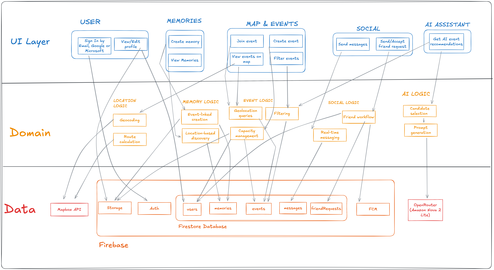

# Map'In

A social map for students that brings events and memories together in one place.

## Concept

Map'In transforms how students discover, attend, and remember events. Instead of scattered group chats and forgotten photos, everything lives on an interactive map — from upcoming parties to past memories.

**The idea is simple:** events happen at places, and places hold memories. Map'In connects these naturally.

## What It Does

### Events
- **Create events** with location, date, capacity, and tags
- **Discover events** on the map — filter by distance, date, or interests
- **Join events** organized by friends, associations, or the community

### Memories
- **Post memories** after attending an event (photos, videos)
- **Tag friends** who were there
- **Relive past events** through a collaborative memory feed

### Social
- **Add friends** and see what events they're attending
- **Chat** with other users directly in the app
- **Build your profile** with interests and badges

### AI Assistant
- **Voice-powered recommendations** — ask for event suggestions hands-free
- Get personalized recommendations based on your location and preferences

### Map
- **Interactive map** showing events and memories
- **Search locations** and get directions
- **Offline support** for saved regions

## Screenshots

<!-- Add screenshots here -->
| Home Map | Event Details | Memories | AI Assistant |
|----------|---------------|----------|--------------|
| *screenshot* | *screenshot* | *screenshot* | *screenshot* |

## Architecture



[View on Excalidraw](https://excalidraw.com/#json=eQsc-cu0dPSd0cFuJvPTc,wAq2zUT_4USJ6sP1JcGehw)

The app follows a three-layer architecture:
- **UI Layer**: Jetpack Compose screens organized by feature
- **Domain Layer**: Business logic for events, social, memories, location, and AI
- **Data Layer**: Firebase (Auth, Firestore, Storage, FCM) and external APIs (Mapbox, OpenRouter)

## Tech Stack

- **Language**: Kotlin
- **UI**: Jetpack Compose
- **Backend**: Firebase (Authentication, Firestore, Storage, Cloud Messaging)
- **Maps**: Mapbox GL
- **AI**: OpenRouter API (Amazon Nova 2 Lite)
- **Architecture**: MVVM with Repository pattern

## Installation

### Prerequisites
- Android Studio Hedgehog or later
- Android SDK 24+

### Setup

1. Clone the repository

2. Add `google-services.json` to the `app/` directory (contact mapin.team.contact@gmail.com for access, or use your own Firebase project for local development)

3. Add your API keys in `local.properties`:
   ```properties
   MAPBOX_ACCESS_TOKEN=your_mapbox_token
   OPENROUTER_API_KEY=your_openrouter_key
   ```

4. Build and run:
   ```bash
   ./gradlew assembleDebug
   ```

## Contributing

Contributions are welcome! Feel free to open issues or submit pull requests.

## Figma

[View the design on Figma](https://www.figma.com/design/1O4tdBFh8A6mPBKelmKLjo/Map-In?node-id=415-64)

## License

This project was developed as part of the Software Enterprise (SwEnt) course at EPFL.

Licensed under the MIT License — see the [LICENSE](LICENSE) file for details.
