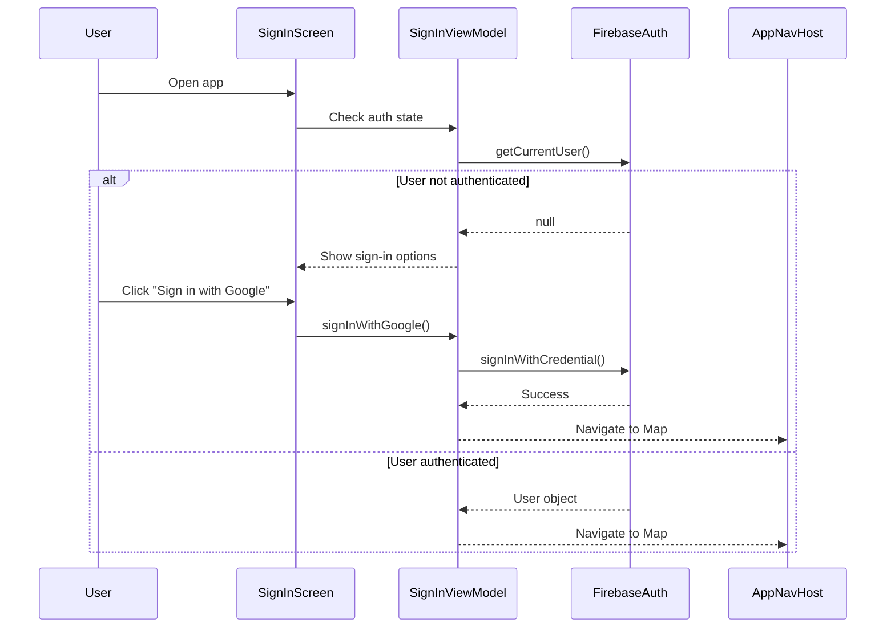
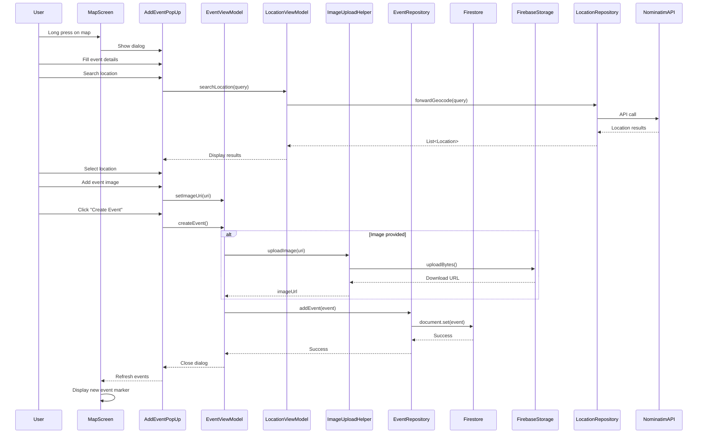
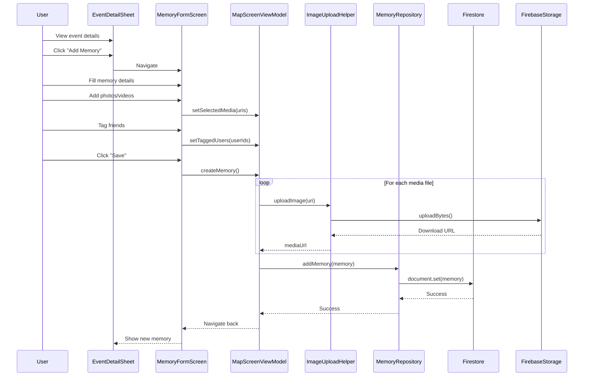
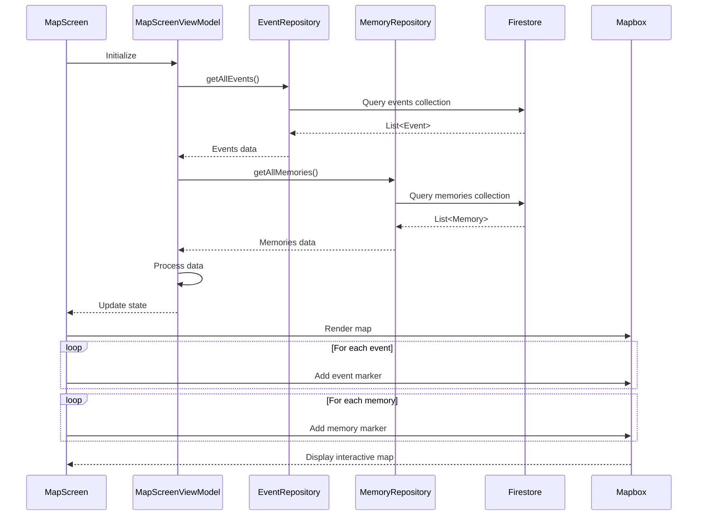
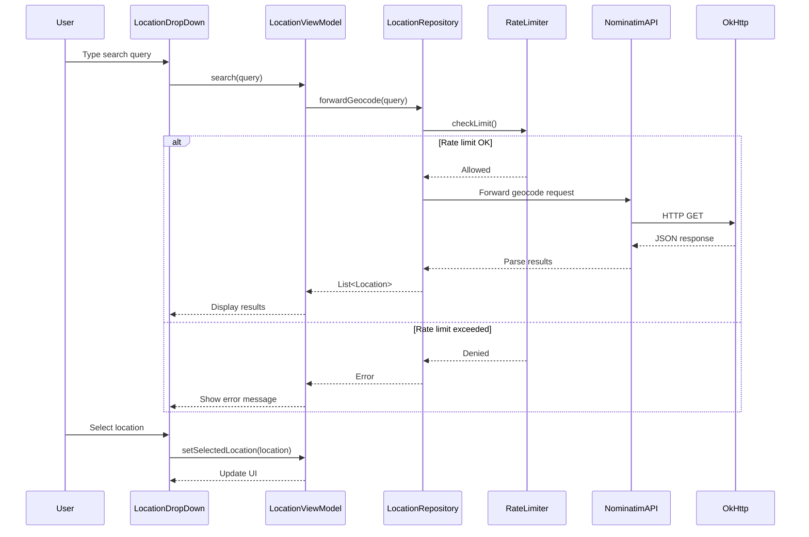
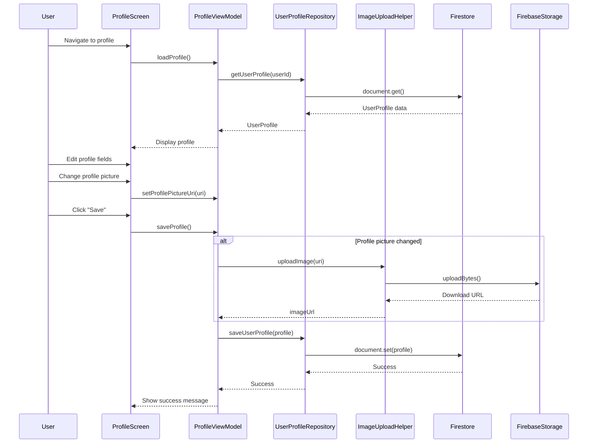
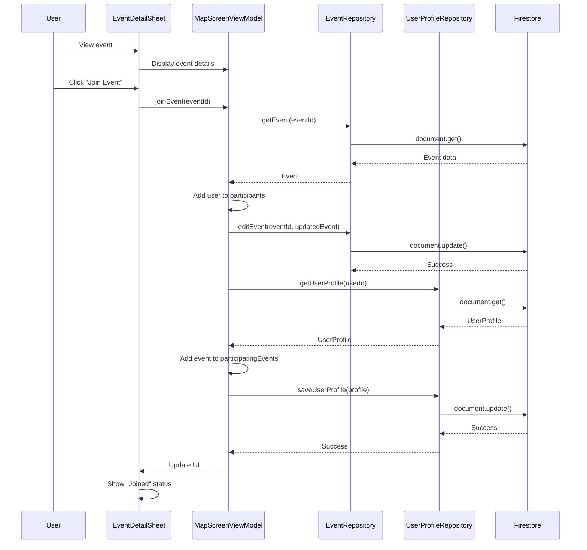
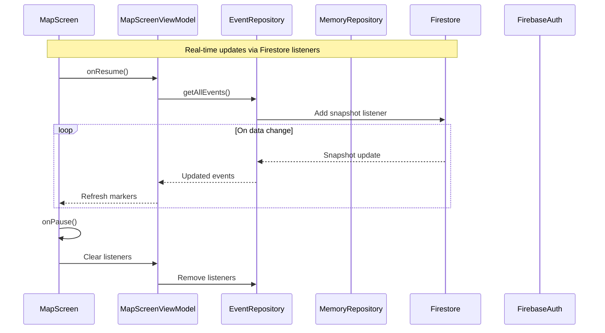
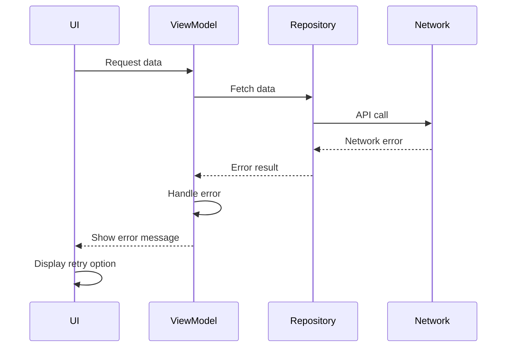
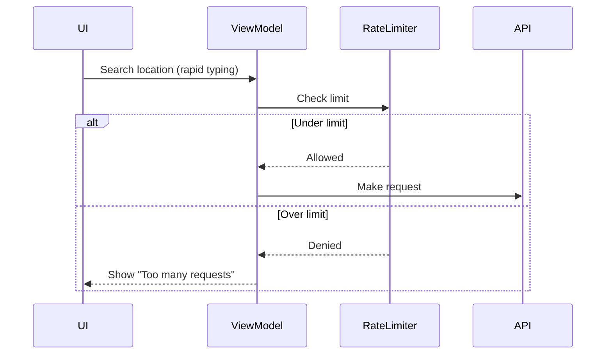

# Map'In User Flow & Sequence Diagrams

This document illustrates the key user flows and their corresponding sequence diagrams in the Map'In application.

## User Authentication Flow



## Event Creation Flow



## Memory Creation Flow



## Map Display & Event Loading Flow



## Location Search Flow



## User Profile Update Flow



## Event Participation Flow



## Data Synchronization Flow



## Key User Journeys

### 1. First-Time User Journey
```
Launch App → Sign In → View Map → Create Profile → Discover Events → Join Event
```

### 2. Create Event Journey
```
View Map → Long Press Location → Fill Event Form → Search Location → Add Image → Save Event → View on Map
```

### 3. Add Memory Journey
```
View Map → Tap Event Marker → View Event Details → Add Memory → Upload Photos → Tag Friends → Save Memory
```

### 4. Event Discovery Journey
```
View Map → Browse Markers → Filter by Tags → View Event Details → Check Participants → Join Event
```

### 5. Profile Management Journey
```
Navigate to Profile → Edit Bio → Add Hobbies → Upload Profile Picture → Save Changes
```

## Error Handling Flows

### Network Error Flow


### Rate Limit Flow


## State Management

### ViewModel State Flow
```
User Action → UI Event → ViewModel → Update State → Recompose UI
```

### Repository State Flow
```
Data Change → Repository Listener → Emit Update → ViewModel → Update UI State
```

## Offline Handling

The app uses local repository implementations for offline support:

```
Network Available:
    UI → ViewModel → FirestoreRepository → Firebase → Update UI

Network Unavailable:
    UI → ViewModel → LocalRepository → In-Memory Storage → Update UI
```

## Concurrency & Threading

```
UI Thread (Main)
    ↓
Compose UI Updates
    ↓
ViewModel (viewModelScope)
    ↓
Coroutines (IO Dispatcher)
    ↓
Repository Operations
    ↓
Firebase/Network (Background)
```

All repository operations are suspend functions executed in coroutine scopes, ensuring non-blocking UI operations.
